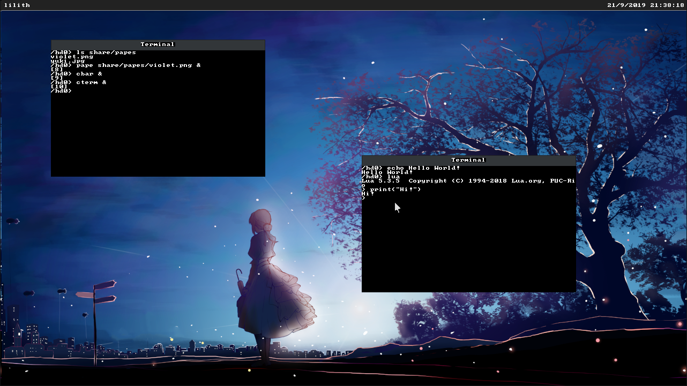

<h1 align="center">lilith</h1>

<p align="center">

</p>

<p align="center">
A POSIX-like x86-64 kernel with a 32-bit userspace written in Crystal/C.
</p>

## Building

lilith needs to be compiled with a patched crystal compiler, to build it, run the command:

```
make toolchain/crystal/.build/crystal
```

You will also need an appropriate `x86_64-elf` binutils toolchain in order to link and assemble the kernel, as well as `i686-elf` binutils to build the bootstrap code.

```
make build/kernel
```

### Building the userspace

A Makefile is provided for building the userspace toolchain, to build it, go to the `userspace/toolchain` directory and use `make`.

Once built, a patched version of GCC/Binutils will be installed in `userspace/toolchain/tools/bin`, simply set your PATH variable to that location and you can use the toolchain (with the `i386-elf-lilith` prefix)

To compile C programs for the system, you'll also need to build the libc. In the `userspace/toolchain` directory, do:

```
make build_libc
```

## Running

A CPU with x64 support is required to run the OS. The Makefile provides a script which will run QEMU on the kernel:

```
make run
```

To run with storage, an MBR-formatted hard drive image with a FAT16 partition must be provided in the running directory with the name `drive.img`. The kernel will automatically boot the `main.bin` executable on the hard drive, or panic if it can't be loaded.

```
make run_img
```

## Features

* [x] Basic x86-64 support
* [x] Hybrid conservative-precise incremental garbage collector
* [x] IDE/ATA support (well, it can only load from primary master)
* [x] FAT16 support
* [x] Basic syscalls (open, read, write, spawn,...)
* [x] Preemptive multitasking!
* [x] Userspace C library written in Crystal/C
* [ ] And much more as I go...

## License

Lilith is licensed under GPLv3.

Unless stated otherwise, all code in the project are licensed
under GPLv3.

*Assembly code under userspace/libc/src/functions/math are
taken from musl-libc and are licensed under MIT.*

*Patches in toolchain/\* are licensed under MIT.
Feel free to upstream them!*
